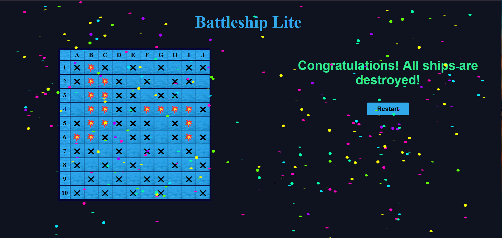

# Battleship Lite

Battleship Lite is a single-player game that utilises a 10x10 grid map. The game automatically generates and positions five ships randomly on the map, orienting them either vertically or horizontally. The size of each ship varies and determines the number of squares it occupies on the grid.

* Carrier (5)
* Battleship (4)
* Cruiser (3)
* Submarine (3)
* Destroyer (2)

The ships in the game cannot overlap, extend beyond the boundaries of the map, and are concealed from the player. Once the game map and ship placement are set, the player can begin searching for the hidden ships by taking aim and firing at a target. The game provides real-time feedback both visually on the map and via textual information displayed below it, indicating the outcome of each shot, such as which ship was hit, how much life it has remaining, or if it has been sunk or missed in a previous attempt.

Note: This Battleship Lite game is updated from my prior Python based terminal app and is now built using HTML, CSS, and JavaScript.

## Screenshots

## License

This project is licensed under the MIT License.
